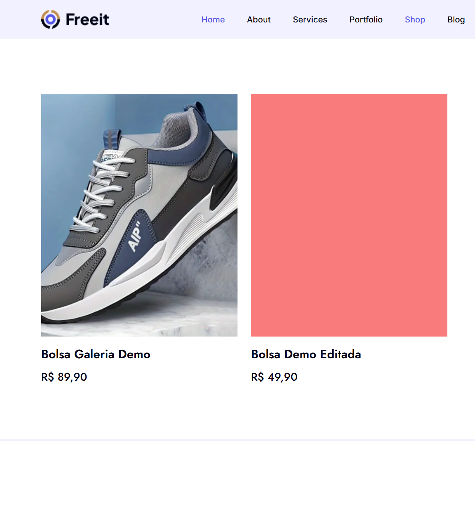
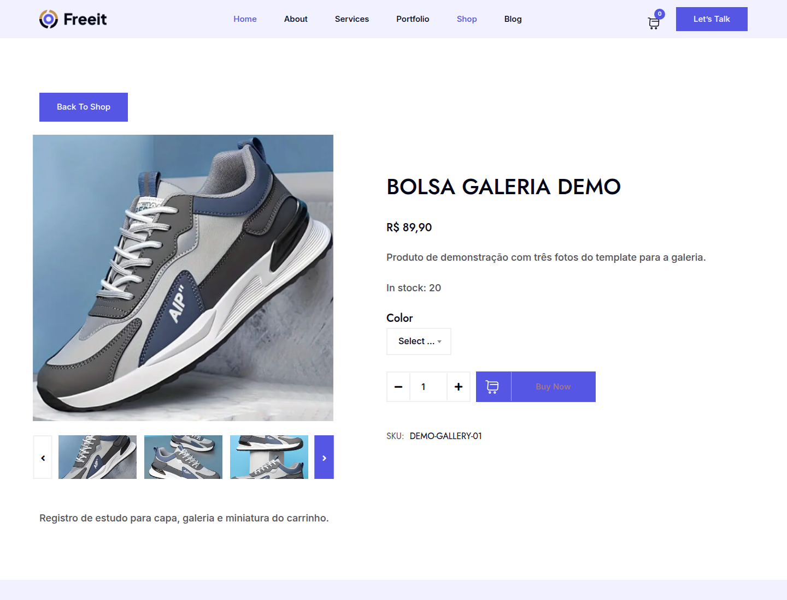
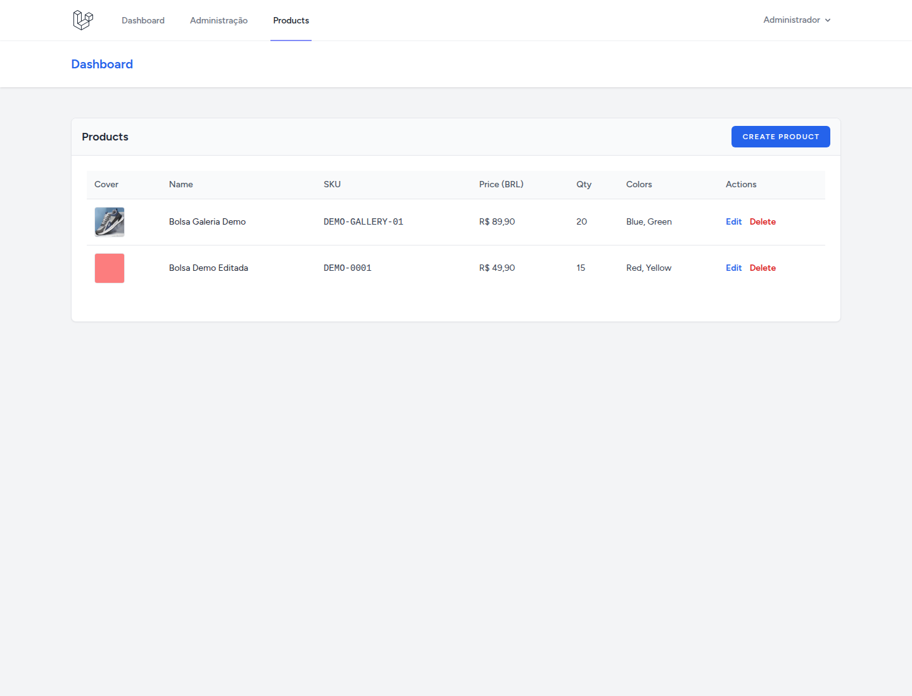
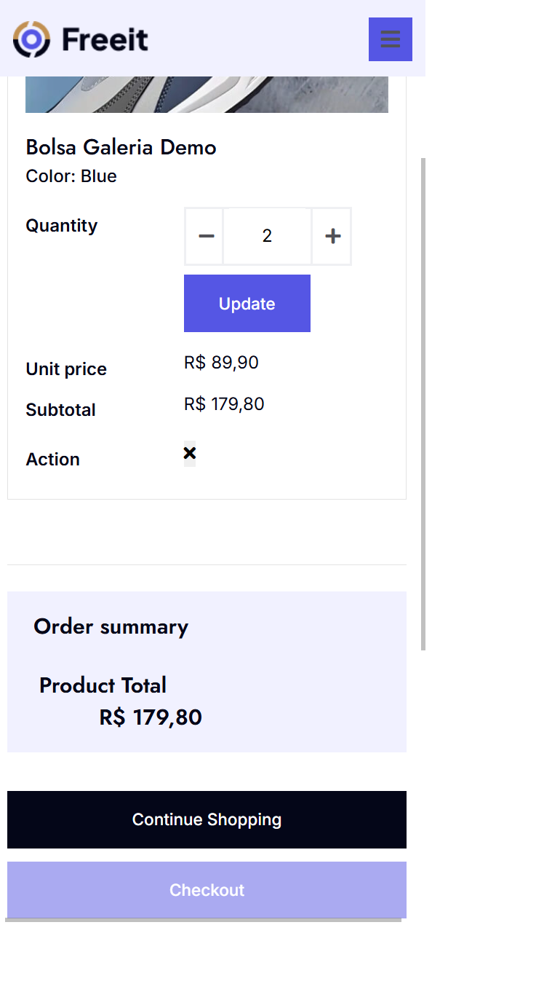

# e-Commerce

Projeto de estudo em Laravel: uma loja com vitrine, detalhes de produto, carrinho por sessão e painel administrativo de produtos. O visual da loja vem do template em Blade; os dados de produto vêm do banco.

Não é um checkout completo. Pagamento, frete, impostos e descontos ficam fora do escopo.

## Funcionalidades

- Vitrine pública (`GET /`): produtos do banco, 12 por página, mais recentes primeiro. Estoque zero permanece visível como indisponível.
- Detalhes (`GET /products/{product}`). A URL antiga `/product-details` redireciona para a vitrine.
- Carrinho por sessão Laravel (`/cart`): adicionar, alterar quantidade e remover linhas. Cada linha é produto + cor. Não há persistência por conta nem sincronização entre dispositivos.
- Painel administrativo (`/admin/products`): cadastro, edição e exclusão definitiva de produtos (imagens, cores, preço, estoque, SKU).
- Autenticação Breeze (cadastro, login, dashboard). O acesso ao painel exige usuário administrador (`access-admin`).
- Checkout desabilitado. O carrinho não reserva estoque nem cria pedido.

## Tecnologias e requisitos

Versões deste repositório (podem diferir do material do curso):

- Laravel 13.31, Breeze 2.4.2 (Blade + PHPUnit), PHP 8.5 (imagem Sail), MySQL 8.4
- `ext-bcmath` obrigatória (`composer.json`); totais do carrinho usam BCMath
- Node.js para Vite (`npm install` / `npm run build`)
- Docker Desktop e WSL. Não é necessário PHP nem Composer no host.

Portas locais (evitam conflito com outro app em 8001): HTTP **8002**, Vite **5174**, MySQL no host **3307**. Projeto Compose: `ecommerce`. Serviços: `laravel.test` e `mysql` apenas.

## Instalação a partir de um clone

O Sail (`./vendor/bin/sail` e `compose.yaml`) depende de `vendor/laravel/sail`. Instale as dependências PHP **antes** de subir os containers.

```bash
git clone <url-do-repositorio>
cd e-Commerce
cp .env.example .env
```

No `.env`, defina `APP_URL=http://localhost:8002` (já vem no exemplo). A senha do MySQL do Compose é a de `DB_PASSWORD` do exemplo (`password`); isso é o padrão do Sail, não uma credencial de produção.

Instale o Composer com a imagem oficial `composer:latest` (sem PHP no host). Essa imagem só serve para gerar `vendor/` (incluindo `vendor/laravel/sail`). A flag `--ignore-platform-req=ext-bcmath` vale **somente** nesse passo: essa imagem não traz `ext-bcmath`, exigida pelo `composer.json`. Não use ignore de plataforma no container Sail que executa a aplicação.

Não use `laravelsail/php85-composer`: essa tag não é publicada no Docker Hub. O runtime do app continua sendo o PHP **8.5** definido em `compose.yaml`, onde `ext-bcmath` está presente.

```bash
docker run --rm \
  -u "$(id -u):$(id -g)" \
  -v "$(pwd):/app" \
  -w /app \
  composer:latest \
  composer install --ignore-platform-req=ext-bcmath
```

O `composer.lock` declara plataforma `php: ^8.3` e deve ser respeitado na instalação.

Suba o ambiente, gere a chave, rode as migrations, o link de storage e o build dos assets. Em seguida, confira os requisitos da plataforma **no Sail**:

```bash
./vendor/bin/sail up -d
./vendor/bin/sail artisan key:generate
./vendor/bin/sail artisan migrate
./vendor/bin/sail artisan storage:link
./vendor/bin/sail npm install
./vendor/bin/sail npm run build
./vendor/bin/sail composer check-platform-reqs
```

`storage:link` é necessário para as imagens de produto no disco `public` (pasta `products`). Não use `migrate:fresh` se já houver dados locais que devam ser preservados.

## URLs

Loja (após `sail up`):

- Vitrine: [http://localhost:8002](http://localhost:8002)
- Detalhes: [http://localhost:8002/products/{id}](http://localhost:8002/products/1)
- Carrinho: [http://localhost:8002/cart](http://localhost:8002/cart)

Administração:

- Login: [http://localhost:8002/login](http://localhost:8002/login)
- Painel: [http://localhost:8002/admin/dashboard](http://localhost:8002/admin/dashboard)
- Produtos: [http://localhost:8002/admin/products](http://localhost:8002/admin/products)

## Administrador local

O `DatabaseSeeder` **não** cria o administrador. Use:

```bash
./vendor/bin/sail artisan db:seed --class=AdminUserSeeder
```

Variáveis no `.env` / `.env.example`: `ADMIN_NAME`, `ADMIN_EMAIL`, `ADMIN_PASSWORD`.

- Deixe a senha **vazia** no `.env.example` e não a publique.
- Na primeira execução, se `ADMIN_PASSWORD` estiver vazia, o seeder gera uma senha aleatória e grava **somente** no `.env` local. Consulte esse arquivo depois do seed; não versionar `.env`.
- Se o e-mail já existir como usuário comum, o seeder aborta sem alterar o registro.
- Padrão quando nome e e-mail estão vazios: nome `Administrador`, e-mail `admin@example.test`.

## Demonstração da galeria

```bash
./vendor/bin/sail artisan db:seed --class=DemoGalleryProductSeeder
```

Cria **Bolsa Galeria Demo**, SKU `DEMO-GALLERY-01`, R$ 89,90, estoque 20, cores Blue e Green, com três fotos. As origens versionáveis estão em `public/frontend/images/product_slide_show_{1,2,3}.jpg`. O seeder é idempotente: se o SKU já existir, não altera o registro.

Outros produtos locais (por exemplo a Bolsa Demo Editada, SKU `DEMO-0001`) **não** são criados por esse seeder e devem ser preservados no banco de desenvolvimento. Após um clone limpo, só a galeria demo reaparece com o comando acima.

## Limitações atuais

- Sem checkout, pagamento, frete, impostos ou descontos.
- Carrinho só na sessão atual (visitante ou autenticado).
- Totais do carrinho consideram apenas preço × quantidade (BCMath, duas casas).
- Buy Now permanece desabilitado.

## Testes

Os testes usam SQLite em memória (`phpunit.xml`) e não usam o MySQL `ecommerce`.

```bash
./vendor/bin/sail artisan test
```

O build de assets da loja (quando necessário):

```bash
./vendor/bin/sail npm run build
```

## Capturas









## Template original e créditos

`original-template/` permanece como referência (não altere esses arquivos). Assets públicos da loja estão em `public/frontend/`. Créditos: Freeit (rodapé) e Mahamudul Hassan Sazal (`css/spacing.css`). Font Awesome: CSS/webfonts Free em `public/frontend`; o kit Pro `js/Font-Awesome.js` não é carregado.

Licença do skeleton Laravel: MIT (`composer.json`).
